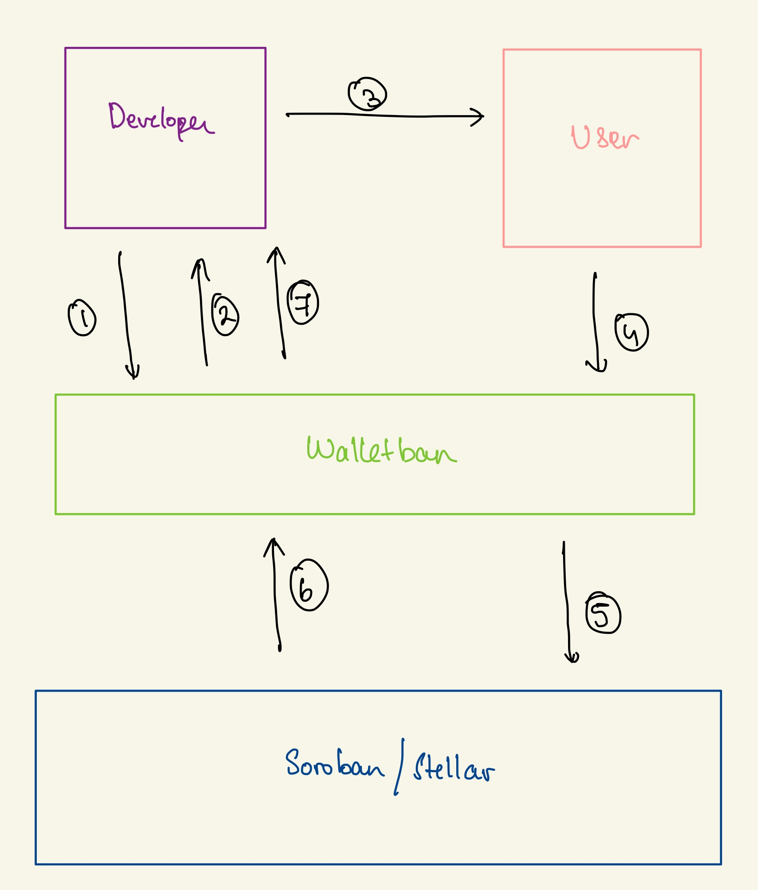

# Walletban

> A walletless onboarding solution for soroban!

## 🤔 What is Walletban?

**Walletban** is a comprehensive platform designed to simplify user onboarding and transaction signing on the Stellar blockchain. By leveraging Google Sign-In and a RESTful API, users can effortlessly create and manage wallets, and securely sign transactions without the need for a traditional wallet. Literally banning wallets!

## Features

- **Google Sign-In Integration:** Seamlessly onboard users using their Google accounts for a streamlined registration process.

- **Wallet Management:** Create and manage Stellar wallets without the need for traditional wallet software.
   
- **Transaction Signing:** Securely sign transactions using the REST API, providing a convenient and efficient way to authorize transfers and operations on the Stellar network.

- **Enhanced Security:** Implement robust security measures to ensure the safety of user data and transaction authorization.
   
- **User-Friendly Interface:** Intuitive user interface to provide a smooth and user-friendly experience for both onboarding and transaction signing processes.
   
- **Scalability and Reliability:** Built to handle a large number of users and transactions, ensuring high performance and reliability at scale.

- **Seamless Integration with Soroban:** Integrates seamlessly with Soroban to provide a holistic solution for managing assets and transactions on the Stellar blockchain.

## 💻 Usage

Head to: https://walletban.xyz!

## 🛠 Architecture and Structure

Walletban completely abstracts away any wallet creation and allows you to interact with soroban via REST APIs!

1. Developer creates a project on https://walletban.xyz
2. Developer gets a ClientID and ClientSecret along with API keys
3. Developer builds a dapp with these credentials
4. User logs into the dapp using walletban
5. Walletban interacts with soroban on behalf of user
6. The blockchain responds with data
7. The developer is presented with this data for the functioning of the dapp.

## ⭐ Show your support

Give a ⭐ if you liked this project!

Spread the word to your fellows to boost producitivity for everyone!

## 🤝 Contributions

- Feel Free to Open a PR/Issue for any feature or bug(s).
- Make sure you follow the [community guidelines](https://docs.github.com/en/github/site-policy/github-community-guidelines) and read [CONTRIBUTING.md.md](https://github.com/DarthBenro008/walletban/CONTRIBUTING.md)!
- Feel free to open an issue to ask a question/discuss anything about walletban.
- Have a feature request? Open an Issue!

## ⚖ License

Copyright 2023 Hemanth Krishna

Licensed under MIT License : https://opensource.org/licenses/MIT

Made with ❤ and single cup of coffee
